# kottans-frontend

# My geetings, <i>Kottans</i>! 

## Про себе

    Я Андрій, 18 років. Нещодавно закінив 1 курс за спеціальністю "Інженерія програмного забезпечення" за освітньою
    програмою "Веб-технології". Риси характеру: цілеспрямований, працьовитий та добрий. 

## Мій досвід в IT

    Маю базові знання мов C, C#, знаю мови розмітки HTML CSS, трохи знаю JS, розбираюся в алгоритмах та структурах
    даних. Також маю досвід с git. Зараз самостійно вивчаю фреймворк React.

# Kottans tasks

## General
- [X] [Git та GitHub](#git-and-github)
- [X] [Linux, Command Line, HTTP Tools](#linux-command-line-and-http-tools)
- [X] [Git для командної співпраці](#git-collaboration)

## Front-End Basic
- [X] [Intro to HTML & CSS](#intro-to-html-and-css)
- [ ] [Responsive Web Design](#responsive-web-design)
- [ ] [HTML & CSS Practice](#html-and-css-practice)
- [ ] [JS basics](#js-basics)
- [ ] [DOM](#dom)

## Advanced Topics
- [ ] [Building a Tiny JS World (pre-OOP) - practice](#building-a-tiny-js-world-pre-oop---practice)
- [ ] [Object-oriented JS - practice](#object-oriented-js---practice)
- [ ] [OOP exercise - practice](#oop-exercise---practice)
- [ ] [Offline Web Applications](#offline-web-applications)
- [ ] [Memory pair game](#memory-pair-game)
- [ ] [Website Performance Optimization](#website-performance-optimization)
- [ ] [Friends APP](#friends-app)

<h1>Comments</h1>

## Git and GitHub  

    Гіт - це не від'ємна частина життя кожного програміста для роботи над великими проєктами, у команді та і просто
    розробляючи якийсь проєкт самотужки! Тому, радий, що <strong><i>Kottans</i></strong> дійсно приклали зусилля, щоб 
    навіть "малеча" змогла зрозуміти такий важливий фрагмент життя програмістів :)

 

    Щодо мене, то я використовую гіт вже останні пів року, але не так конкретно, як тут. Особисто відкрив нові
    можливості гіта та дуже вражений. Буду використовувати надалі. Дякую за чудовий матеріал, 
    <strong><i>Kottans <3</i></strong> 

## Screenshots

### Coursera

    
Week 1

    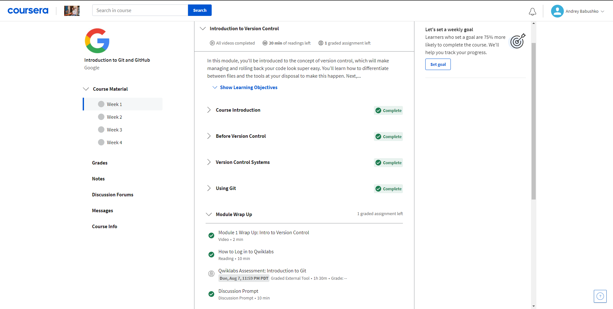

        
Week 2

        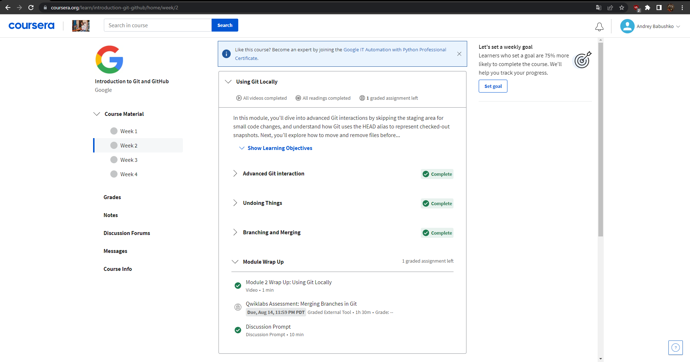

### Learn git branching

    
Basics

    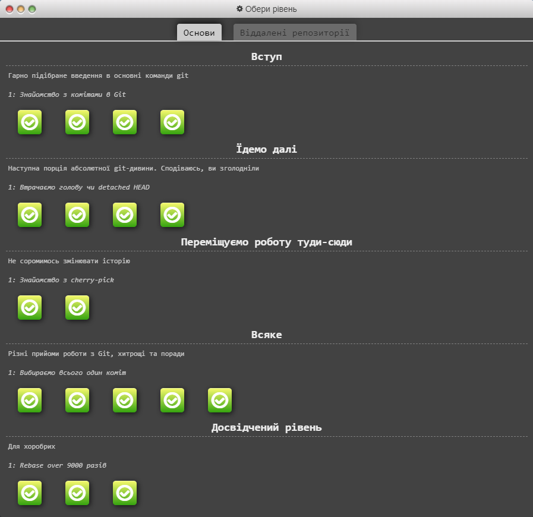

        
Remote repositories

        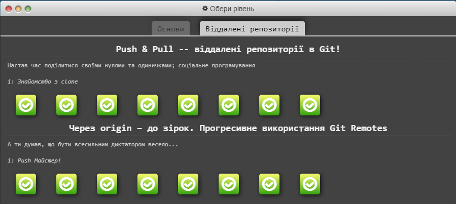

### Typing club

    Також пройшов 100 рівнів на <a href="https://www.typingclub.com/">typingclub</a>:

## Linux Command Line and HTTP Tools

    Linux survival справив на мене двояке враження. З одного боку, знання роботи Linux системи та його команд необхідне
    для будь-якого розробника. Це допомагає перевірити код на його працездатність. Саме 
    Linux надає необхідне середовище
    для цього, а також команди для інсталяції необхідних пакетів, які є не дуже складні для вивчення. З другого боку, 
    усі команди, які були на цьому курсі, а саме для роботи з файлами(створення, видалення, об'єднання), принтером та
    інше можна зробити за допомогою прикладних програм операційної системи та будь-яких редакторів. 

    Але все ж таки, на мою думку, я пройшов цей курс не марно тому, що до цього я не працював з 
    Linux і з його Ubuntu.
    Використання команд, хоч і досить простих, дало мені змогу зрозуміти принцип роботи системи 
    Linux. Може, надалі,
    мені знадобляться ці знання і, може, я буду мати необхідність або бажання пізнати 
    Linux ще більше. 

    Щодо статей про HTTP. Я ніколи не читав про це і навіть не здогадувався, що це є настільки важливим для 
    веб-розробників. Буду відвертим, для мене виявилось досить багато не зрозумілих понять. Поки не дуже зрозумів, де
    саме потрібно використовувати потрібні бібліотеки для роботи 
    HTTP.  та його методи. Думаю, що це розуміння прийде з
    часом і з досвідом.

## Screenshots

### Linux survival

    
Quiz 1

    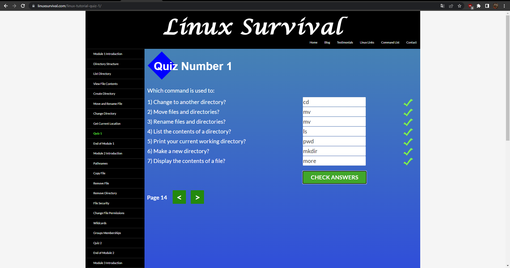

        
Quiz 2

        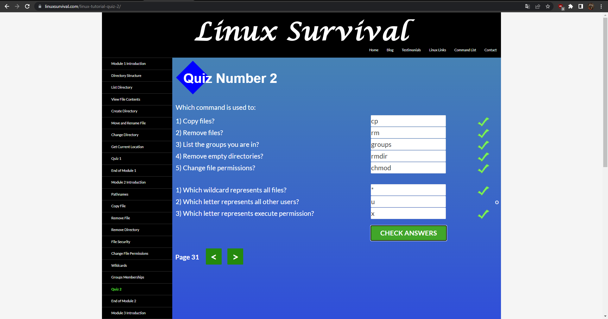

    
Quiz 3

    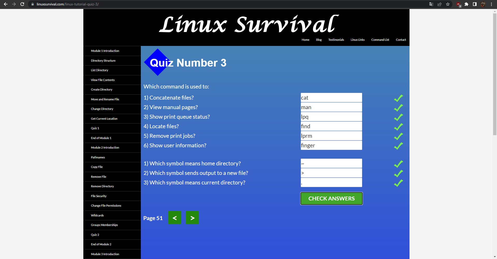

        
Quiz 4

        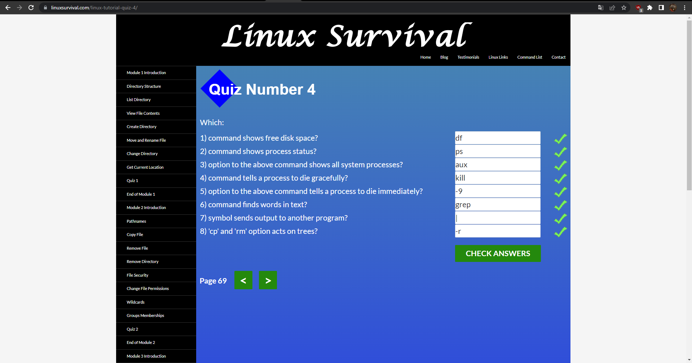

## Git Collaboration

    Курс на 
    
        <a href="https://www.coursera.org/learn/introduction-git-github">Courser-і</a>
    
    виявився для мене досить корисним та пізнавальним. Саме тут я дізнався те, що потрібно та навіть отримав посилання
    на додатковий матеріал для більш поглибленого вивчення системи контролю версій. Сам я б навряд одразу пішов
    отримувати та вивчати стільки всього про Git. Також доповненням було викладання усього матеріалу англійською мовою,
    що дещо прокачало мої навички розуміння IT сленгу та деяких визначень.

    Щодо завдань на 
    
        <a href="https://learngitbranching.js.org/?locale=uk">learngitbranching</a>,
     
    то, особисто для мене, вони виявилися корисними. Я дізнався досить велику кількість Git команд, які будуть 
    корисними у більшості ситуацій, зрозумів за допомогою візуалізації, як працюють ті чи інші команди. Я рекомендую 
    цей ресурс для новачків програмістів, які тільки починають свій шлях в IT. Це дасть їм можливість відслідковувати
    свій код поетапно, зберігати копії коду, щоб у випадку термінової ситуації, можна було повернутися до минулої
    версії програми, якісно писати та рефакторити код, а також будувати особисте портфоліо для працевлаштування у
    майбутньому.

## Screenshots

### Coursera

    
Week 3

    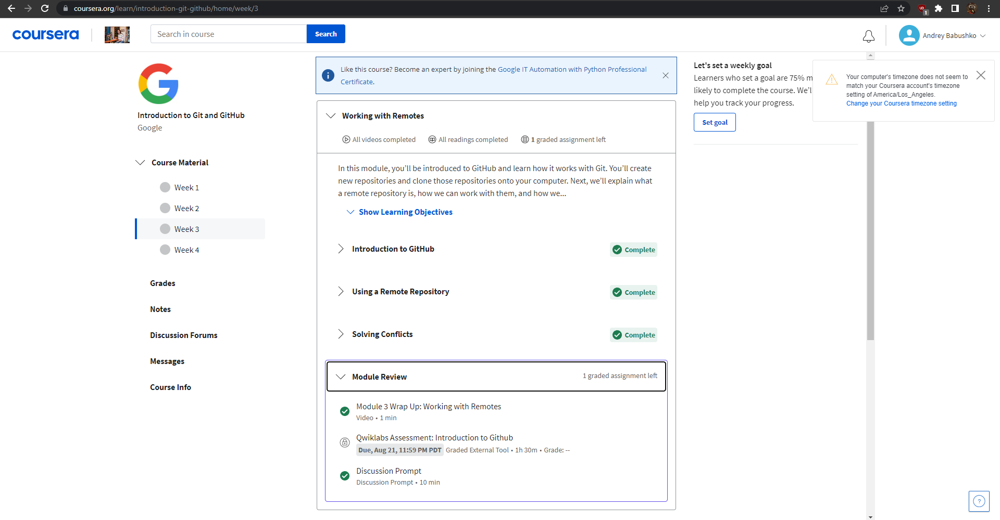

        
Week 4

        

### Learn git branching

    
Basics

    

        
Remote repositories

        

## Intro to HTML and CSS

    Відверто скажу, що тут я майже зовсім не знайшов чогось нового чи корисного, бо 95% усього матеріалу я вивчав
    особисто в університеті, інше - це нюанси чи тонкості, які одразу чи не зрозумієш чи не знайдеш. Єдине, що я 
    дійсно піймав - це додаткову практику та змогу засвоїти матеріал ще краще. 

## Screenshots

### Coursera

    
Week 1

    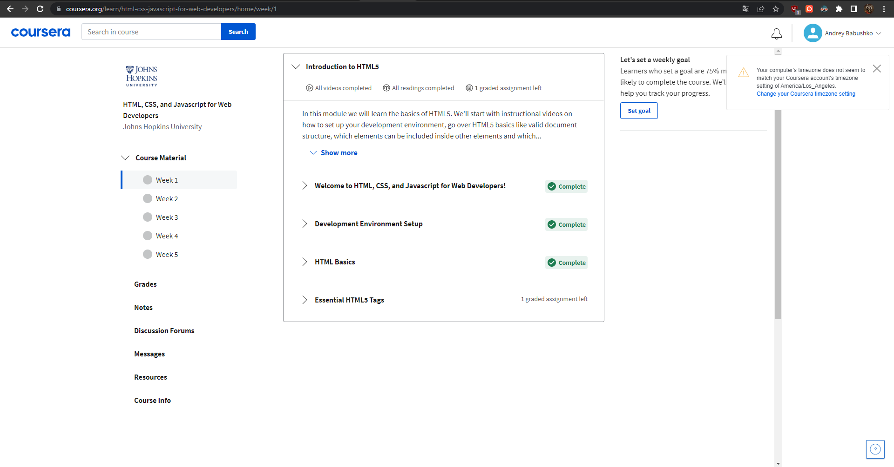

        
Week 2

        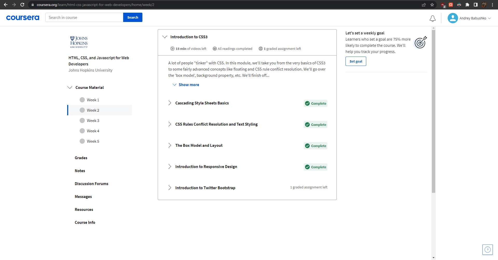

### Codecademy

    
Html progress and syllabus

    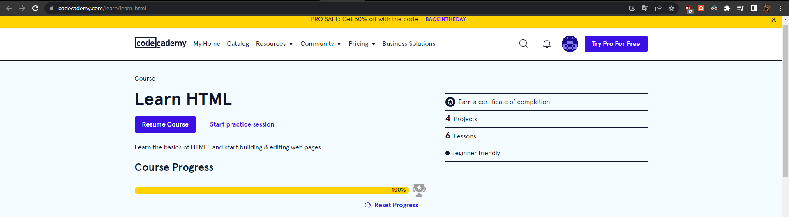
    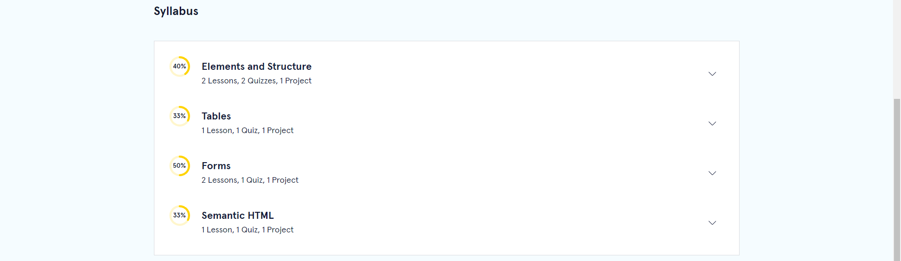

    
Css progress and syllabus

    
    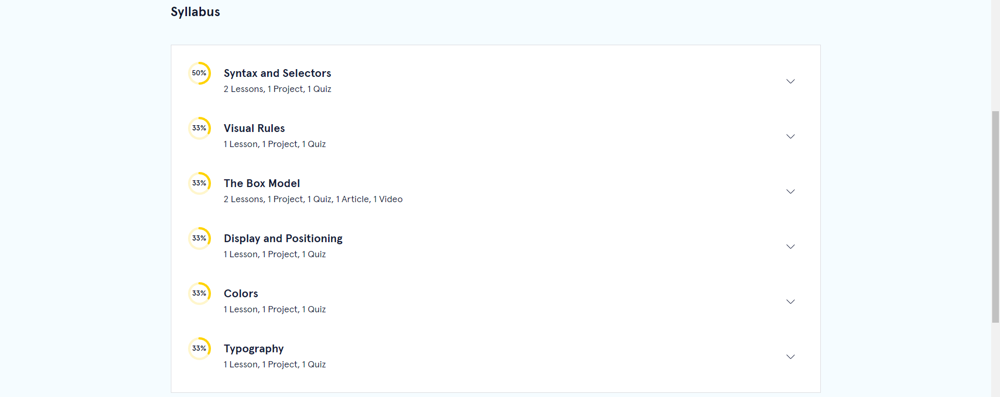

## Responsive Web Design

## Screenshots

## HTML and CSS Practice

## Screenshots

## JS basics

## Screenshots

## DOM

## Screenshots

## Building a Tiny JS World (pre-OOP) - practice

## Screenshots

## Object-oriented JS - practice

## Screenshots

## OOP exercise - practice

## Screenshots

## Offline Web Applications

## Screenshots

## Memory pair game

## Screenshots

## Website Performance Optimization

## Screenshots

## Friends APP

## Screenshots

